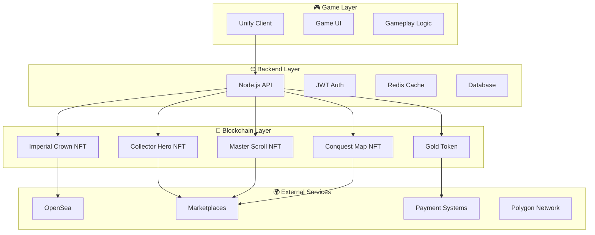
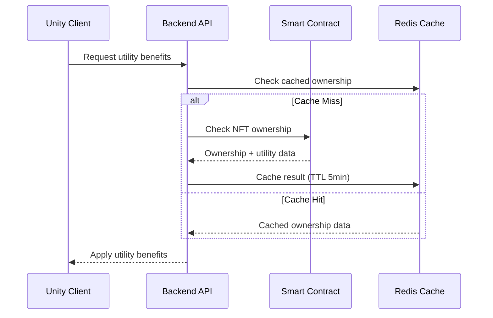
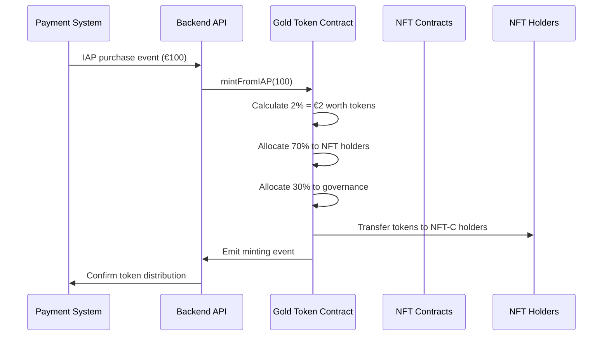
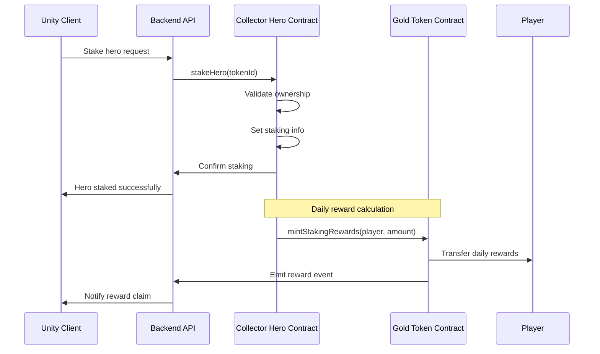
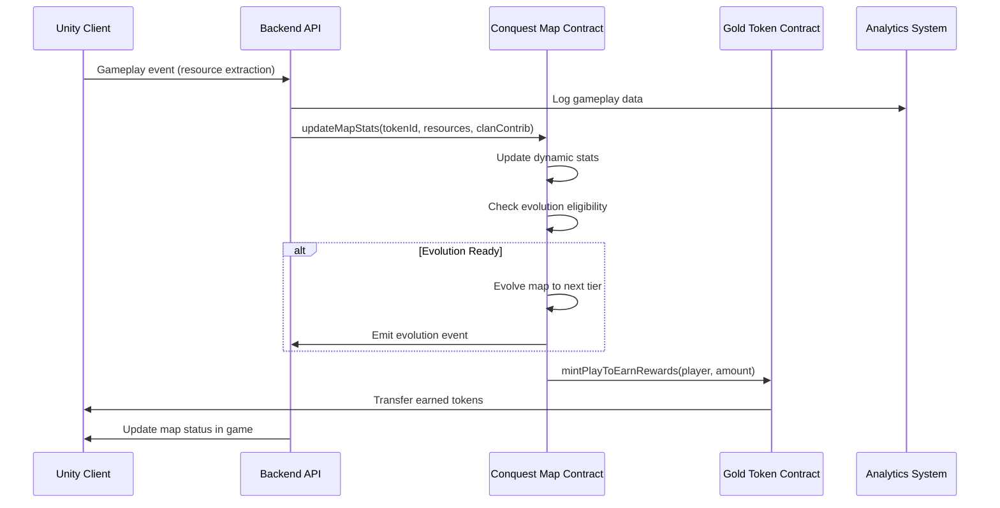
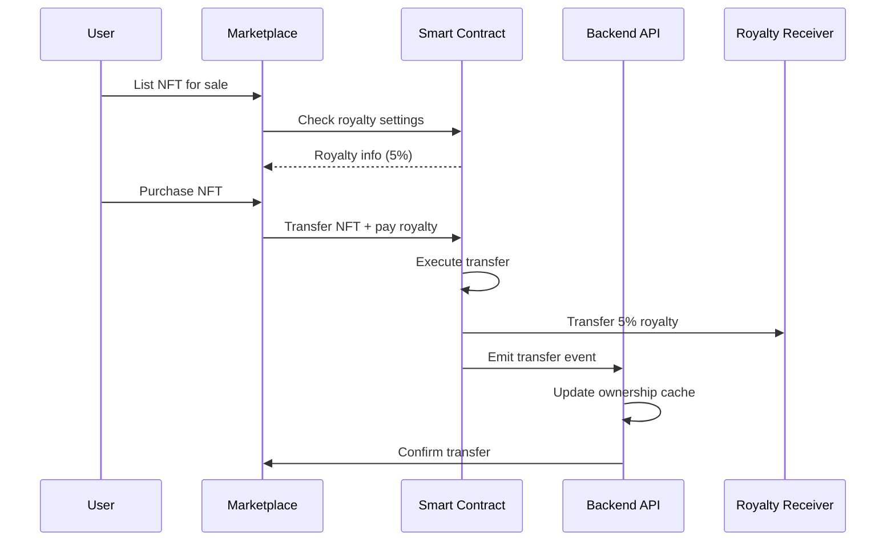

# 🏗️ Smart Contract Architecture & Communication Flows

**Project:** NFT Gaming Research 086  
**Document Type:** High-Level Architecture  
**Date:** January 7, 2025  
**Purpose:** Understand smart contract usage and communication flows  

---

## 🎯 **Executive Overview**

This document provides a high-level architectural overview of how the NFT Gaming Research 086 smart contracts integrate with the broader gaming ecosystem. It outlines the communication flows between smart contracts, backend systems, Unity game client, and external services.

**Key Components:**
- 🎮 **Unity Game Client** - Mobile RPG-strategy game
- 🌐 **Backend API** - Node.js/Express with JWT authentication
- 🔗 **Smart Contracts** - 5 contracts on Polygon network
- 👥 **Users** - Players, NFT holders, and community
- 🛒 **External Services** - Marketplaces, payment systems

---

## 🏗️ **System Architecture Overview**



---

## 🔄 **Core Communication Flows**

### **1. 🏆 NFT Ownership & Utility Verification Flow**



**Flow Description:**
1. **Unity Client** requests utility benefits for player
2. **Backend API** checks Redis cache for recent ownership data
3. If cache miss, **API** queries smart contract for ownership
4. **Smart Contract** returns ownership status and utility benefits
5. **API** caches result and applies benefits to game client
6. **Unity Client** receives and applies utility benefits

### **2. 🪙 Gold-Token Minting & Distribution Flow**



**Flow Description:**
1. **Payment System** processes in-app purchase (IAP)
2. **Backend API** receives purchase event with amount
3. **API** calls Gold-Token contract to mint 2% of purchase value
4. **Gold-Token Contract** calculates and allocates tokens:
   - 70% to active Conquest Map NFT holders
   - 30% to community governance fund
5. **Tokens** are automatically distributed to eligible holders
6. **Payment System** receives confirmation of token distribution

### **3. 🦸 Collector Hero Staking Flow**



**Flow Description:**
1. **Unity Client** initiates hero staking through game UI
2. **Backend API** validates request and calls smart contract
3. **Collector Hero Contract** validates ownership and stakes hero
4. **Daily rewards** are automatically calculated and minted
5. **Gold-Token Contract** distributes staking rewards
6. **Unity Client** receives notifications of available rewards

### **4. 🗺️ Conquest Map Dynamic Updates Flow**



**Flow Description:**
1. **Unity Client** sends gameplay events (resource extraction, clan wars)
2. **Backend API** logs analytics and updates smart contract stats
3. **Conquest Map Contract** updates dynamic metadata and checks evolution
4. **Contract** mints play-to-earn rewards based on activity
5. **Gold-Token Contract** distributes earned tokens to player
6. **Unity Client** receives updated map status and rewards

### **5. 🏪 Marketplace Integration Flow**



**Flow Description:**
1. **User** lists NFT on marketplace (OpenSea, etc.)
2. **Marketplace** queries smart contract for royalty information
3. **Smart Contract** returns 5% royalty configuration
4. **Purchase** executes with automatic royalty payment
5. **Smart Contract** transfers NFT and pays royalty to project
6. **Backend API** receives transfer event and updates cache
7. **Marketplace** confirms successful transaction

---

## 🔧 **Smart Contract Integration Points**

### **Backend API Integration**

| Contract | Integration Points | Purpose |
|----------|-------------------|---------|
| **Imperial Crown** | `getUtilityBenefits()` | Verify 30% IAP discount, +15% PvP bonus |
| **Collector Hero** | `getUtilityBenefits()`, `stakeHero()`, `claimRewards()` | Daily rewards, staking, skill access |
| **Master Scroll** | `getUtilityBenefits()`, `useCraftingDiscount()` | 10% IAP discount, crafting benefits |
| **Conquest Map** | `updateMapStats()`, `getUtilityBenefits()` | Dynamic updates, play-to-earn rewards |
| **Gold-Token** | `mintFromIAP()`, `mintStakingRewards()` | Token distribution, reward systems |

### **Unity Game Integration**

| Feature | Smart Contract Function | Game Implementation |
|---------|------------------------|-------------------|
| **IAP Discounts** | `getUtilityBenefits()` | Apply discount in purchase flow |
| **PvP Bonuses** | `getUtilityBenefits()` | Modify win rate calculations |
| **Resource Multipliers** | `getUtilityBenefits()` | Apply extraction bonuses |
| **Daily Rewards** | `claimDailyReward()` | Show reward notifications |
| **Staking UI** | `stakeHero()`, `unstakeHero()` | Staking interface in game |
| **Map Evolution** | `getUtilityBenefits()` | Display evolution status |

---

## 🔐 **Security & Access Control**

### **Role-Based Access Control**

| Role | Smart Contract | Permissions |
|------|----------------|-------------|
| **MINTER_ROLE** | All NFT Contracts | Mint new NFTs, batch operations |
| **PAUSER_ROLE** | All Contracts | Emergency pause/unpause |
| **STAT_UPDATER_ROLE** | Conquest Map | Update dynamic stats |
| **REWARD_MANAGER_ROLE** | Collector Hero | Manage skill unlocks |
| **DEFAULT_ADMIN_ROLE** | All Contracts | Configure settings, manage roles |

### **Security Measures**

- **🔒 Access Control:** Role-based permissions for all critical functions
- **⏸️ Pausable Contracts:** Emergency stop functionality
- **🔄 Rate Limiting:** Backend API rate limiting for contract calls
- **💾 Caching:** Redis cache to reduce blockchain queries
- **🛡️ Input Validation:** Comprehensive parameter validation
- **📊 Monitoring:** Real-time monitoring of contract interactions

---

## 📊 **Performance Optimization**

### **Gas Optimization Strategies**

- **⚡ Batch Operations:** Batch minting and transfers for efficiency
- **🗂️ ERC-1155:** Semi-fungible tokens for bundle operations
- **💾 Caching:** 5-minute TTL cache for ownership data
- **🔄 Event Monitoring:** Real-time events instead of polling
- **📦 Contract Optimization:** Via IR compilation for gas efficiency

### **Scalability Considerations**

- **🌐 Polygon Network:** Low-cost transactions (~$0.001 gas)
- **📈 Horizontal Scaling:** Backend API can scale independently
- **💾 Database Optimization:** Efficient query patterns
- **🔄 Load Balancing:** Multiple API instances for high availability
- **📊 Monitoring:** Performance metrics and alerting

---

## 🎮 **User Experience Flows**

### **New Player Journey**

1. **🎮 Game Download** → Install Unity game client
2. **👤 Account Creation** → Create game account (no wallet required)
3. **🎯 Gameplay** → Play free-to-play game
4. **💰 IAP Purchase** → Buy in-game items (with potential NFT discounts)
5. **🔗 NFT Discovery** → Learn about NFT utility benefits
6. **💳 NFT Purchase** → Buy NFT through game or marketplace
7. **✨ Utility Activation** → Automatic benefit application
8. **🎉 Enhanced Gameplay** → Enjoy utility benefits and rewards

### **NFT Holder Journey**

1. **🏆 NFT Ownership** → Own one or more utility NFTs
2. **🎮 Game Login** → Connect wallet or verify ownership
3. **✨ Benefit Application** → Automatic utility benefit activation
4. **💰 Reward Earning** → Earn Gold-tokens through gameplay
5. **🏪 Trading** → Trade NFTs on secondary market
6. **👑 Premium Experience** → Enhanced gameplay with utility benefits

---

## 🔄 **Data Flow Summary**

### **Real-Time Data Flow**
```
Game Events → Backend API → Smart Contracts → Blockchain
     ↓              ↓              ↓              ↓
Analytics ← Cache Update ← Event Monitoring ← Network
```

### **Caching Strategy**
- **🕐 TTL:** 5-minute cache for NFT ownership data
- **🔄 Invalidation:** Real-time invalidation on transfers
- **📊 Monitoring:** Cache hit/miss ratio tracking
- **⚡ Performance:** Sub-second response times

### **Event-Driven Architecture**
- **📡 WebSocket:** Real-time updates to Unity client
- **🔔 Notifications:** Push notifications for rewards
- **📊 Analytics:** Real-time gameplay data collection
- **🔄 Synchronization:** Automatic state synchronization

---

## 🎯 **Business Impact**

### **Revenue Generation**
- **💰 Primary Sales:** €515k-€620k from NFT sales
- **🔄 Secondary Market:** 5% royalty on all resales
- **🎮 Play-to-Earn:** Sustainable Gold-token economy
- **📈 LTV Increase:** 13-50% increase for NFT holders

### **User Engagement**
- **🎯 Retention:** Enhanced retention through utility benefits
- **💰 Monetization:** Increased IAP conversion through discounts
- **👥 Community:** Strong community through NFT ownership
- **🔄 Viral Growth:** Word-of-mouth through utility value

---

## 🚀 **Implementation Roadmap**

### **Phase 1: Core Integration (Weeks 1-2)**
- ✅ Smart contract deployment and verification
- ✅ Backend API integration with ownership verification
- ✅ Basic Unity client integration for utility benefits

### **Phase 2: Advanced Features (Weeks 3-4)**
- ✅ Staking system integration
- ✅ Dynamic NFT updates and evolution
- ✅ Play-to-earn reward distribution

### **Phase 3: Optimization (Weeks 5-6)**
- ✅ Performance optimization and caching
- ✅ Security audit and fixes
- ✅ User experience enhancements

### **Phase 4: Launch (Weeks 7-8)**
- ✅ Production deployment
- ✅ Marketplace integration
- ✅ Community launch and marketing

---

## 📋 **Conclusion**

The smart contract architecture provides a robust foundation for the NFT Gaming Research 086 ecosystem, enabling:

- **🎮 Seamless Integration** between blockchain and game
- **💰 Sustainable Economy** through utility-first design
- **🔒 Security** through comprehensive access control
- **⚡ Performance** through optimization and caching
- **📈 Scalability** for future growth and expansion

The communication flows ensure efficient, secure, and user-friendly interactions between all system components, creating a premium NFT gaming experience that delivers real value to holders while maintaining game balance and regulatory compliance.

---

**Document Status:** ✅ Complete  
**Next Review:** Upon smart contract implementation  
**Version:** 1.0  

---

*This architecture document provides the foundation for implementing the smart contract integration and communication flows for the NFT Gaming Research 086 project.*
